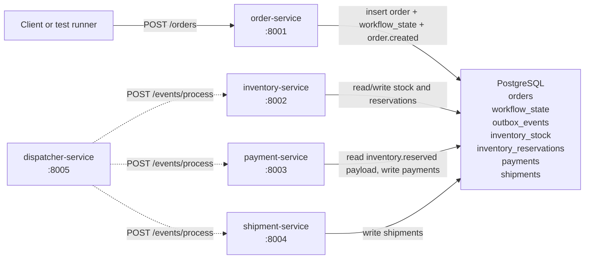
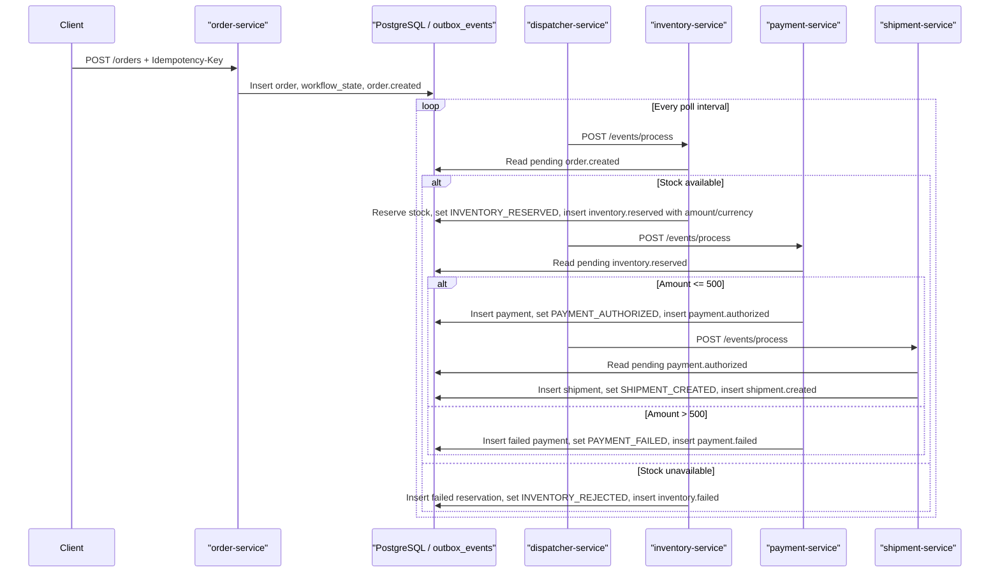

# Distributed Order Processing & Inventory Management System

[](https://github.com/Sivarohitk/Distributed-Order-Processing-Inventory-Management-System/actions/workflows/ci.yml)


A Python microservices project that models order intake, inventory reservation, payment authorization, and shipment creation using FastAPI, PostgreSQL, and a shared transactional outbox table.

This repository is intentionally small enough to review in an interview, but it still demonstrates idempotent writes, asynchronous workflow progression, shared state tracking, containerized local startup, end-to-end tests, and CI automation.

Related documentation:
- [Architecture Notes](docs/architecture.md)
- [Roadmap And Limitations](docs/roadmap.md)
- [Workflow Diagrams](docs/workflow-diagrams.md)
- [GitHub Actions CI Workflow](.github/workflows/ci.yml)

## Repository Highlights

- End-to-end order workflow across five focused FastAPI services
- Transactional outbox plus idempotent order intake using PostgreSQL
- Docker Compose local environment with GitHub Actions end-to-end CI
- Structured workflow logging, docs, and lightweight developer tooling

## What This Project Demonstrates

- Designing a small but realistic asynchronous business workflow
- Applying pragmatic reliability patterns such as idempotency, health checks, and event processing
- Balancing demo simplicity with clear documentation of current limits and future evolution

## Project Overview

The system is composed of five services:

- `order-service` accepts orders and creates the initial workflow state.
- `inventory-service` consumes `order.created` events and reserves stock.
- `payment-service` consumes `inventory.reserved` events and simulates payment authorization.
- `shipment-service` consumes `payment.authorized` events and creates shipments.
- `dispatcher-service` polls each downstream service's `/events/process` endpoint so the workflow advances automatically.

For local-demo simplicity, all services share one PostgreSQL database. The database stores the business tables, the `workflow_state` read model, and a shared `outbox_events` table.

## Current Features

- FastAPI-based Python microservices with clear workflow ownership
- Shared PostgreSQL persistence for orders, workflow state, outbox events, inventory, payments, and shipments
- Idempotent order creation via the `Idempotency-Key` header
- Transactional creation of `orders`, `workflow_state`, and `order.created` in one database transaction
- Seeded inventory data for three demo SKUs
- Background dispatcher polling every 5 seconds by default
- Consistent JSON-style workflow logs with service, event type, order ID, and result fields
- Happy-path, inventory-failure, and payment-failure end-to-end tests
- GitHub Actions CI that boots the stack with Docker Compose and runs the test suite

## High-Level Architecture



## Services And Responsibilities

| Service | Port | Responsibility | Key Endpoints | API Docs |
| --- | --- | --- | --- | --- |
| `order-service` | `8001` | Accepts orders, enforces idempotency, initializes `workflow_state`, and writes `order.created` to `outbox_events` | `POST /orders`, `GET /orders/{order_id}`, `GET /workflows/{order_id}`, `GET /outbox/pending`, `GET /health` | [http://127.0.0.1:8001/docs](http://127.0.0.1:8001/docs) |
| `inventory-service` | `8002` | Seeds demo stock, consumes `order.created`, creates inventory reservations, and emits `inventory.reserved` or `inventory.failed` | `GET /inventory/{sku}`, `GET /reservations/{order_id}`, `POST /events/process`, `GET /health` | [http://127.0.0.1:8002/docs](http://127.0.0.1:8002/docs) |
| `payment-service` | `8003` | Consumes `inventory.reserved`, creates payment records, and emits `payment.authorized` or `payment.failed` | `GET /payments/{order_id}`, `POST /events/process`, `GET /health` | [http://127.0.0.1:8003/docs](http://127.0.0.1:8003/docs) |
| `shipment-service` | `8004` | Consumes `payment.authorized`, creates shipment records, and emits `shipment.created` | `GET /shipments/{order_id}`, `POST /events/process`, `GET /health` | [http://127.0.0.1:8004/docs](http://127.0.0.1:8004/docs) |
| `dispatcher-service` | `8005` | Runs a background loop that calls the downstream `/events/process` endpoints and also exposes a manual run-once endpoint | `POST /dispatch/run-once`, `GET /health` | [http://127.0.0.1:8005/docs](http://127.0.0.1:8005/docs) |

## Event Workflow

1. A client sends `POST /orders` to `order-service` with an `Idempotency-Key` header.
2. `order-service` inserts the order, initializes `workflow_state` with `ORDER_CREATED`, and writes `order.created` to `outbox_events` in the same transaction.
3. `dispatcher-service` calls `inventory-service` at `POST /events/process`.
4. `inventory-service` consumes pending `order.created` events.
   - If stock is available, it creates a reservation, sets `current_step` to `INVENTORY_RESERVED`, and emits `inventory.reserved` with the `amount` and `currency` that `payment-service` needs.
   - If stock is unavailable, it creates a failed reservation, sets `current_step` to `INVENTORY_REJECTED`, sets `order_status` to `FAILED`, and emits `inventory.failed`.
5. `dispatcher-service` calls `payment-service` at `POST /events/process`.
6. `payment-service` consumes pending `inventory.reserved` events and uses the event payload for `amount` and `currency`.
   - If `amount <= 500`, it creates an authorized payment, sets `current_step` to `PAYMENT_AUTHORIZED`, and emits `payment.authorized`.
   - If `amount > 500`, it creates a failed payment, sets `current_step` to `PAYMENT_FAILED`, sets `order_status` to `FAILED`, and emits `payment.failed`.
7. `dispatcher-service` calls `shipment-service` at `POST /events/process`.
8. `shipment-service` consumes pending `payment.authorized` events, creates a shipment, sets `current_step` to `SHIPMENT_CREATED`, sets `order_status` to `COMPLETED`, and emits `shipment.created`.
9. In the current implementation, no downstream service consumes `inventory.failed`, `payment.failed`, or `shipment.created`, so those terminal events are stored for audit with a non-pending status and do not remain in `GET /outbox/pending`.

## Event Sequence Diagram



## Project Structure

```text
.
|- .editorconfig
|- .env.example
|- LICENSE
|- README.md
|- Makefile
|- docker-compose.yml
|- pyproject.toml
|- requirements-test.txt
|- docs/
|  |- architecture.md
|  |- roadmap.md
|  `- workflow-diagrams.md
|- scripts/
|  |- demo.ps1
|  |- demo.py
|  `- demo.sh
|- services/
|  |- dispatcher-service/
|  |- inventory-service/
|  |- order-service/
|  |- payment-service/
|  `- shipment-service/
|- shared/
|  `- models/
|- tests/
|  `- test_e2e_workflow.py
`- .github/
   `- workflows/
      `- ci.yml
```

## Local Startup With Docker Compose

Prerequisites:

- Docker Engine or Docker Desktop
- Docker Compose v2
- Python 3.11 if you want to run the test suite locally

Start the full stack:

```bash
docker compose up --build -d
```

Check the running containers:

```bash
docker compose ps
```

Optional health checks:

```bash
curl http://127.0.0.1:8001/health
curl http://127.0.0.1:8002/health
curl http://127.0.0.1:8003/health
curl http://127.0.0.1:8004/health
curl http://127.0.0.1:8005/health
```

Useful runtime notes:

- `order-service` creates the shared `orders`, `workflow_state`, and `outbox_events` tables on startup.
- `inventory-service` creates `inventory_stock` and `inventory_reservations`, then seeds `SKU-CHAIR-01`, `SKU-TABLE-01`, and `SKU-LAMP-01`.
- `payment-service` creates the `payments` table.
- `shipment-service` creates the `shipments` table.
- `dispatcher-service` starts polling automatically after startup.

Stop and remove the stack:

```bash
docker compose down -v
```

## Developer Workflow

`docker compose` reads a local `.env` file automatically. Start by copying the example file:

```bash
cp .env.example .env
```

PowerShell:

```powershell
Copy-Item .env.example .env
```

Common commands from the repo root:

```bash
make up
make ps
make logs
make rebuild
make test
make down
make clean
```

Notes:

- `make up` starts the stack with the current images.
- `make rebuild` rebuilds images and starts the stack again.
- `make test` runs `pytest tests -v`, so start the stack first with `make up` or `make rebuild`.
- If `make` is not installed on your machine, use the equivalent `docker compose` and `pytest` commands shown in this README.

## Demo Script

With the stack already running, you can walk through one full happy-path order using:

```bash
bash scripts/demo.sh
```

PowerShell:

```powershell
./scripts/demo.ps1
```

The demo script creates one order, waits for the workflow to reach `SHIPMENT_CREATED`, then prints the order ID, final workflow state, and shipment record.

The shell and PowerShell entry points run the demo from inside the Docker Compose network, so the command stays reliable even on machines where local proxy settings interfere with `localhost` HTTP calls.

## Formatting And Linting

This repository uses [`ruff`](https://docs.astral.sh/ruff/) for lightweight linting and formatting, with shared settings in [pyproject.toml](pyproject.toml).

Install it once in your local Python environment:

```bash
python -m pip install ruff
```

Run the lint checks:

```bash
python -m ruff check .
```

Run the formatter on files you touched:

```bash
python -m ruff format path/to/file.py
```

If you intentionally want a broader cleanup, you can run `python -m ruff format .`.

## API Docs URLs

Once the stack is running, FastAPI serves interactive docs at:

- `order-service`: [http://127.0.0.1:8001/docs](http://127.0.0.1:8001/docs)
- `inventory-service`: [http://127.0.0.1:8002/docs](http://127.0.0.1:8002/docs)
- `payment-service`: [http://127.0.0.1:8003/docs](http://127.0.0.1:8003/docs)
- `shipment-service`: [http://127.0.0.1:8004/docs](http://127.0.0.1:8004/docs)
- `dispatcher-service`: [http://127.0.0.1:8005/docs](http://127.0.0.1:8005/docs)

## Example curl Commands

Create an order:

```bash
curl -X POST http://127.0.0.1:8001/orders \
  -H "Idempotency-Key: demo-order-001" \
  -H "Content-Type: application/json" \
  -d '{
    "customer_id": "cust-001",
    "sku": "SKU-LAMP-01",
    "quantity": 2,
    "amount": 120.00,
    "currency": "usd"
  }'
```

Fetch workflow state for a specific order:

```bash
curl http://127.0.0.1:8001/workflows/<order_id>
```

Inspect seeded inventory for a SKU:

```bash
curl http://127.0.0.1:8002/inventory/SKU-LAMP-01
```

Manually trigger one dispatcher pass:

```bash
curl -X POST http://127.0.0.1:8005/dispatch/run-once
```

Inspect downstream records:

```bash
curl http://127.0.0.1:8003/payments/<order_id>
curl http://127.0.0.1:8004/shipments/<order_id>
```

Inspect pending outbox events:

```bash
curl http://127.0.0.1:8001/outbox/pending
```

## Running Tests

The end-to-end tests expect the full Docker Compose stack to be running locally, including `dispatcher-service`.

Install the test dependencies:

```bash
python -m pip install --upgrade pip
pip install -r requirements-test.txt
```

Run the test suite:

```bash
pytest tests -v
```

Or, after the stack is already running:

```bash
make test
```

Current test coverage in `tests/test_e2e_workflow.py` includes:

- Happy path from order creation to shipment creation
- Inventory failure when requested quantity exceeds available stock
- Payment failure when `amount > 500`

## Continuous Integration

GitHub Actions is already configured in [`.github/workflows/ci.yml`](.github/workflows/ci.yml).

The workflow currently:

- Runs on pushes to `main`
- Runs on pull requests targeting `main`
- Starts the stack with `docker compose up --build -d`
- Waits for the services to come up
- Installs `requirements-test.txt`
- Executes `pytest tests -v`
- Prints container logs on failure
- Shuts the stack down with `docker compose down -v`

