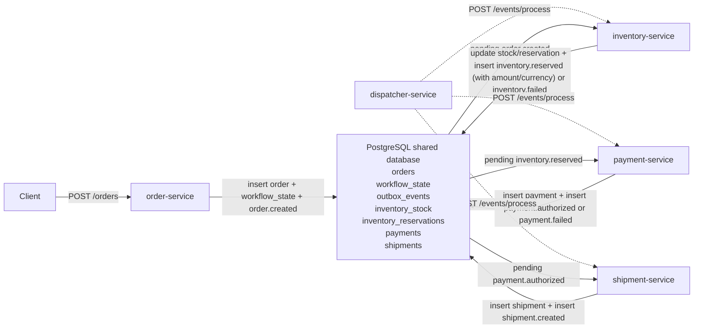
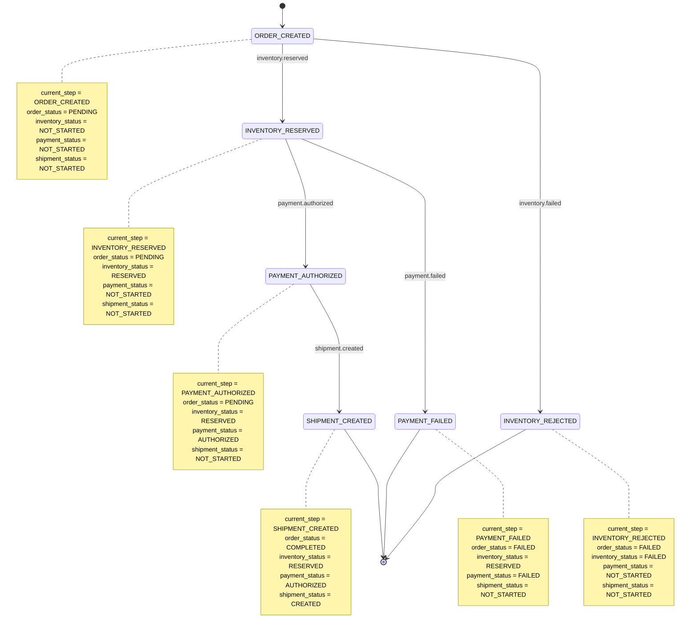

# Workflow Diagrams

See also:
- [Repository README](../README.md)
- [Architecture Notes](architecture.md)

## High-Level Workflow Diagram

Notes:

- `dispatcher-service` automates progression by calling the downstream processing endpoints on a loop.
- `inventory.failed`, `payment.failed`, and `shipment.created` are still emitted in the current implementation, but they are stored as already handled audit events instead of being left pending.

## Workflow State Progression Diagram

This state diagram reflects the values stored in the `workflow_state` table today. The `orders.status` column now mirrors the terminal lifecycle outcome: it stays `PENDING` while work is in flight, then becomes `FAILED` or `COMPLETED` when the workflow reaches a terminal state.
